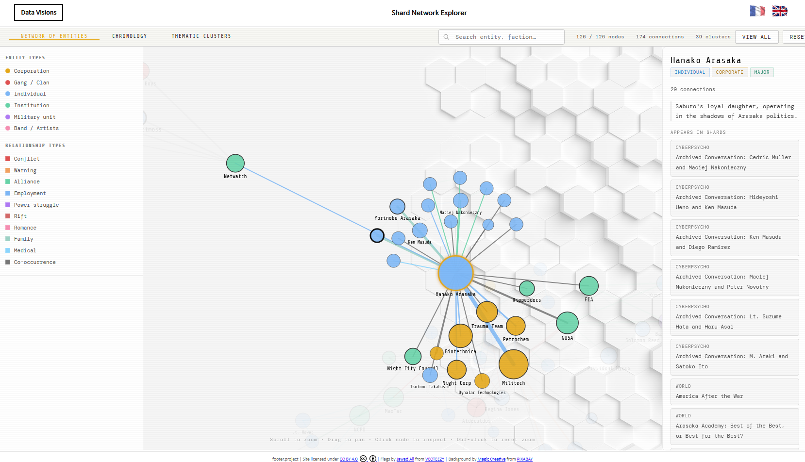
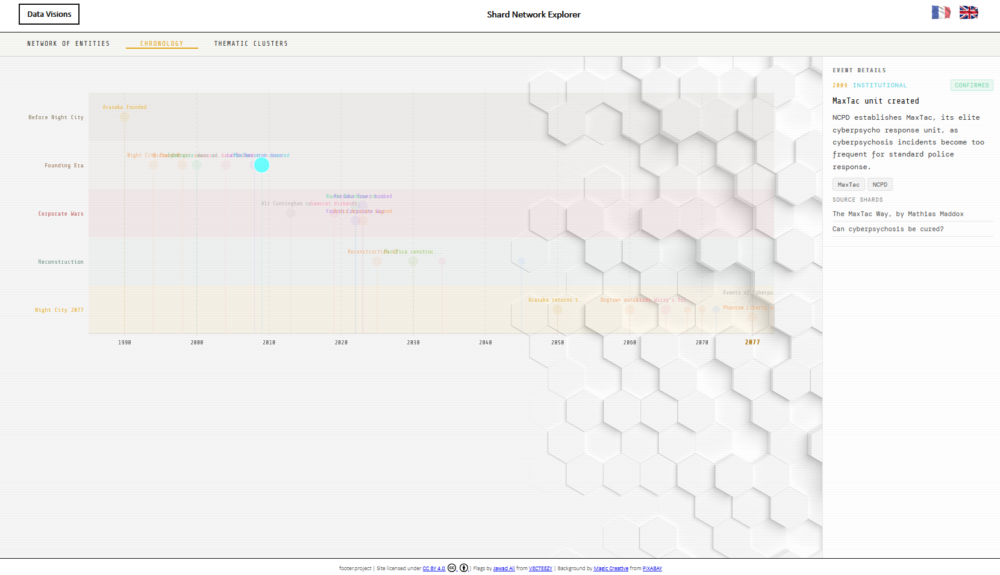
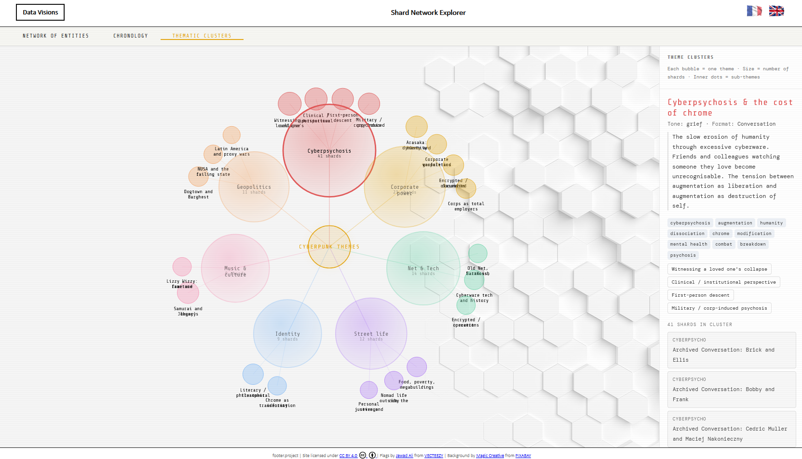

# cyberpunk_shards

I really enjoyed Cyberpunk 2077 for its rich world, hidden secrets, and the way the community documents lore. **This project is a small exploration of what can be visualised when you start from data that is well documented and structured**.

## Author

Matthieu GRALL, as part of the DATA VISIONS collective.

## License

[![CC BY 4.0][cc-by-shield]][cc-by]

Those documents are licensed under a 
[Creative Commons Attribution 4.0 International License][cc-by].

[![CC BY 4.0][cc-by-image]][cc-by]

[cc-by]: http://creativecommons.org/licenses/by/4.0/
[cc-by-image]: https://i.creativecommons.org/l/by/4.0/88x31.png
[cc-by-shield]: https://img.shields.io/badge/License-CC%20BY%204.0-lightgrey.svg

## What this project does

**The app turns curated Cyberpunk shard data into three complementary visual stories**:

- **Entity Network** — a graph of characters, corporations, gangs, institutions and their co-occurrences across shards.
- **Lore Timeline** — a chronological view of events and stories drawn from shard sources.
- **Theme Clusters** — a thematic mindmap that groups shards by narrative and concept.

The aim is not to be an exhaustive game guide, but to show how rich lore and secret-filled documentation can become visual data.

## Main data source

Primary reference: **Cyberpunk Wiki (Fandom)** "shard" pages and related lore documentation. The dataset is enriched manually from publicly available player and community documentation.

## Architecture

The project is built with plain HTML, CSS and vanilla JavaScript, using D3 for SVG visualisation.

- `index.html` — application shell and layout
- `styles/main.css` — dark cyberpunk theme and shared UI styles
- `src/main.js` — bootstrap: load datasets, render navigation, mount views
- `src/ui/view-manager.js` — register views and handle view switching
- `src/ui/ui-controller.js` — shared UI helpers for search, legend, detail panels and stats
- `src/graph/graph-builder.js` — build graph data from shard and entity JSON
- `src/graph/graph-renderer.js` — D3 force-directed graph rendering
- `src/timeline/view-timeline.js` — horizontal timeline view
- `src/clusters/view-clusters.js` — theme cluster mindmap view
- `data/` — source JSON datasets

## Features

- zoomable, pannable network graph
- search and filter by entity type
- detail panels linking back to source shards
- timeline event exploration with category colouring
- cluster drill-down by theme and sub-theme

## Running locally

The app must be served over HTTP, not opened directly as `file://`.

Recommended options:

- VS Code Live Server
- `python -m http.server 8080`
- `npx serve .`

## Conclusion

**This project shows that with rich, well-structured lore data, you can build meaningful visualisations that reveal narrative connections and hidden detail. The Cyberpunk world is full of secrets, and good data makes those secrets easier to explore**.
